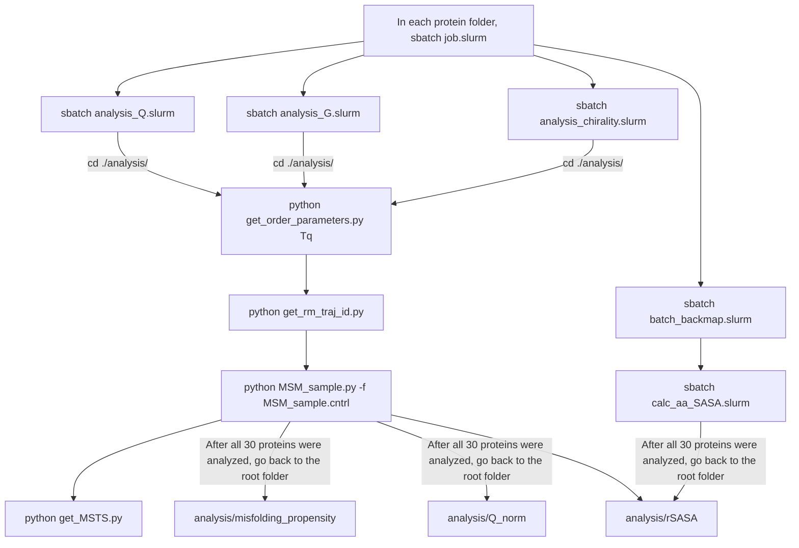

| Folder | Contents |
| ------ | -------- |
| `YU_E` | Subfolders containing input files for the 10 young-ubiquitinated and entangled proteins |
| `NU_NE` | Subfolders containing input files for the 10 non-ubiquitinated and non-entangled proteins |
| `NU_E` | Subfolders containing input files for the 10 non-ubiquitinated and entangled proteins |
| `analysis/misfolding_propensity` | • Python script v5 for computing misfolding propensity using the last 500 ns, 300 ns, and 100 ns of the 2-μs simulation trajectories. This generates Fig. 2G and H.   • Python script v6 for computing misfolding propensity using every 1000 ns in the extended simulation trajectories (20 μs). The metastable states were clustered using order parameters Q and G computed every 10 frames. This generates Fig. S21A and B. |
| `analysis/Q_norm` | • Python script v4 for computing Qnorm using the last 500 ns, 300 ns, and 100 ns of the 2-μs simulation trajectories.   • Python script v5 for computing Qnorm using every 1000 ns in the extended simulation trajectories (20 μs). The metastable states were clustered using order parameters Q and G computed every 10 frames. This generates Fig. S21C and D. |
| `analysis/rSASA` | Python script for computing rSASA using the last 100 ns SASA values of the simulation trajectories |

| File | Contents |
| ------ | -------- |
| `backmap_trajectory.py` | Back-map the CG structure to all-atom for simulation trajectories. Require the back-mapping script from [here](https://github.com/obrien-lab/cg_simtk_protein_folding/blob/master/Backmapping/backmap.py) |
| `calc_aa_sasa.py` | Compute per-residue SASA for all-atom structures in a simulation trajectory |

Within each protein subfolder, you will find:

- A `setup` folder containing:
  - AlphaFold structure (`.pdb` format)
  - Secondary structural elements definition file (`secondary_struc_defs.txt`)
  - Domain definition file (`domain_def.dat`)
  - Coarse-grained (CG) model files (`.psf`, `.cor`, `.prm`, `.top`)

  All these files were obtained from the previous step [`0_gen_parameters`](../0_gen_parameters/)

- `Tq.cntrl`  
  Simulation setup parameters for 2-microsecond temperature-quench simulations. User can change the simulation steps to reproduce the 20-microsecond simulations as well. The code and usage instructions can be found [here](https://github.com/obrien-lab/cg_simtk_protein_folding/wiki/temperature_quenching.py).

- `job.slurm`  
  SLURM script for submitting the simulation job to a GPU cluster. The underlying code and usage instructions are available [here](https://github.com/obrien-lab/cg_simtk_protein_folding/wiki/temperature_quenching.py). This will create two folders `./output` and `./traj`.

- `analysis_Q.slurm`  
  SLURM script for submitting the analysis job for the order parameter **Q** to a CPU cluster. The code and usage instructions are available [here](https://github.com/obrien-lab/cg_simtk_protein_folding/wiki/calc_native_contact_fraction.pl). This will create a folder `./analysis/qbb`.

- `analysis_G.slurm`  
  SLURM script for submitting the analysis job for the order parameter **G** to a CPU cluster. The code and usage instructions are available [here](https://github.com/obrien-lab/cg_simtk_protein_folding/wiki/calc_entanglement_number_v2.pl). This will create a folder `./analysis/G`.

- `analysis_chirality.slurm`  
  SLURM script for submitting the analysis job for the order parameter **K** to a CPU cluster. The code and usage instructions are available [here](https://github.com/obrien-lab/cg_simtk_protein_folding/wiki/calc_chirality_number.pl). This will create a folder `./analysis/chirality`.

- `batch_backmap.slurm`  
  SLURM script for submitting the back-mapping job for the last 100 ns trajectries to a CPU cluster. This will create a folder `./aa_traj_last_100ns`.

- `calc_aa_SASA.slurm`  
  SLURM script for submitting the per-residue SASA calculation job for the last 100 ns all-atom trajectries to a CPU cluster. This will create a file `./analysis/aa_SASA.npy`.

- An `analysis` folder containing:
  - `get_order_parameters.py`  
    Python script to parse order parameters Q, G, and K from text files and save them as NumPy arrays. Run the command `python get_order_parameters.py Tq`, which will generate `Tq_QBB_0.npy`, `Tq_G_0.npy` and `Tq_K_0.npy`.
  - `get_rm_traj_id.py`  
    Python script to identify trajectories containing mirror-image structures, which are removed in downstream analyses. Run the command `python get_rm_traj_id.py`.
  - `MSM_sample.py`  
    Python script to cluster simulation structures into metastable states, extract representative structures, and plot −ln(P) and state maps. Run the command `python MSM_sample.py -f MSM_sample.cntrl`. This generates `MSM.svg`, which was used to make Fig. 2A, C and E, and panel A on Figs. S1 to S20, and S22 to S31, `msm_data.npz`, `Tq_state_map_data.npz`, `Raw_data_Free_energy_Tq.csv`, `Raw_data_State_map_Tq.csv`, `sampled_traj.dcd` and a folder `state_struct/`
  - `MSM_sample.cntrl`  
    Configuration file for `MSM_sample.py`. Update file paths as needed when running on your system. The parameter `skip_traj_list_1`, if present, was obtained from `get_rm_traj_id.py`. 
  - `get_MSTS.py`  
    Python script to plot state probabilities as a function of simulation time. Run the command `python get_MSTS.py`. This generates `MSTS.svg`, which was used to make panel B in Figs. S1 to S20, and S22 to S31, `MSTS_data.npz` and `MSTS_Tq.csv`.
  - `state_struct/`
    Folder generated after running `MSM_sample.py`, containing representative structures (`.pdb`), VMD visualization scripts (`.tcl`) and rendered images (`.tga`). These images were used to generates Fig. 2B, D and F, and panel C in Figs. S1 to S20, and S22 to S31.

  ## Workflow

