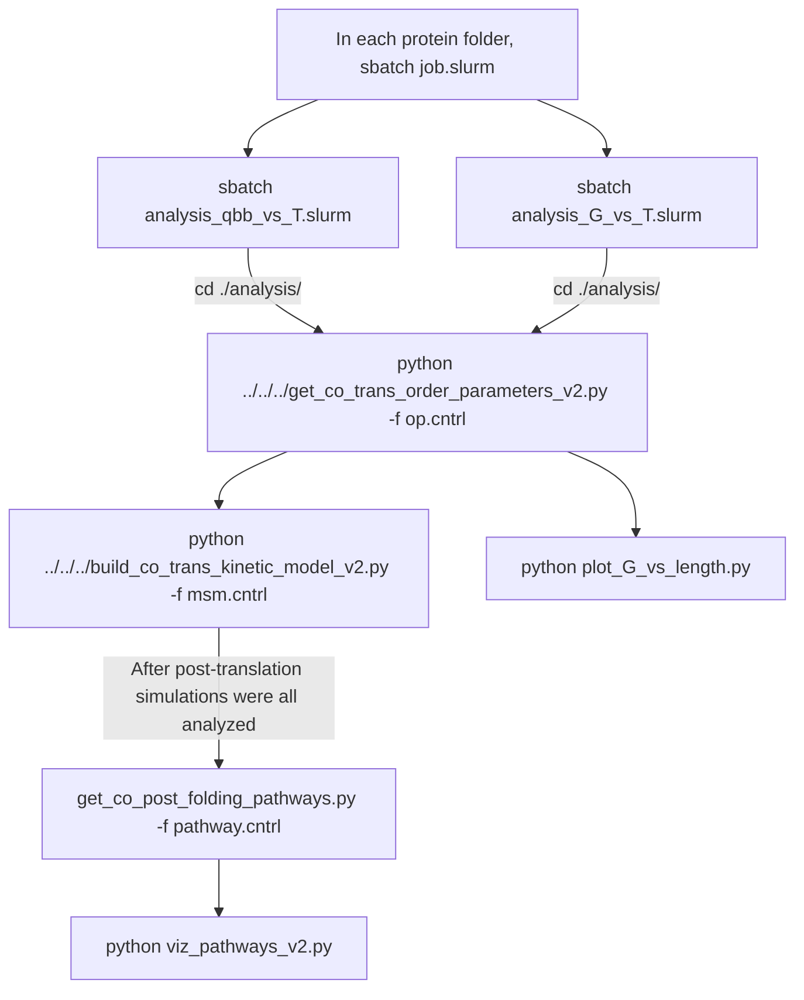

| Folder | Contents |
| ------ | -------- |
| `P16152/1-50/` | Subfolders containing input files for running co-translational folding simulations for the young-ubiquitinated and entangled protein P16152 |
| `A6NDU8/1-50/` | Subfolders containing input files for running co-translational folding simulations for the non-ubiquitinated and non-entangled protein A6NDU8 |

| File | Contents |
| ------ | -------- |
| `get_co_trans_order_parameters_v2.py` | Python script to parse order parameters Q and G from text files and save them as NumPy arrays |
| `build_co_trans_kinetic_model_v2.py` | Python script to cluster co-translational folding simulation structures into metastable states and extract representative structures |

Within each protein subfolder, you will find:

- A `setup` folder containing:
  - AlphaFold structure (`.pdb` format) obtained from AlphaFold database
  - Secondary structural elements definition file (`secondary_struc_defs.txt`) generated from [`0_gen_parameters`](../0_gen_parameters/)
  - Domain definition file (`domain_def.dat`) obtained from [`0_gen_parameters`](../0_gen_parameters/)
  - Coarse-grained (CG) protein model files (`.psf`, `.cor`, `.prm`, `.top`) generated from [`0_gen_parameters`](../0_gen_parameters/)
  - CG human ribosome model files (`8g61_60S_cg_truncated.psf`, `8g61_60S_cg_truncated.cor`, `8g61_60S_cg.top`, `ribosome_Yang.prm`)
  - Protein mRNA sequence file (`*_mrna.txt`) obtained from NCBI.

- `CSP.cntrl`  
  Simulation setup parameters for continuous synthesis simulations. Details can be found [here](https://github.com/obrien-lab/cg_simtk_protein_folding/wiki/continuous_synthesis_v7.py).

- `job.slurm`  
  SLURM script for submitting the simulation job to a GPU cluster. The underlying code and usage instructions are available [here](https://github.com/obrien-lab/cg_simtk_protein_folding/wiki/continuous_synthesis_v7.py). This will create two folders `./output` and `./traj`. The trajectories and outputs are available on [CyVerse](https://data.cyverse.org/dav-anon/iplant/projects/NCEMS/working-groups/protein-misfolding-aging/data/Protein-entanglement-misfolding-determines-divergent-fates/continuous_synthesis/).

- `analysis_qbb_vs_T.slurm`  
  SLURM script for submitting the analysis job for the order parameter **Q** to a CPU cluster. The underlying code and usage instructions are available [here](https://github.com/obrien-lab/cg_simtk_protein_folding/wiki/calc_cont_synth_qbb_vs_T.py). This will create a folder `analysis/qbb_full_vs_T`

- `analysis_G_vs_T.slurm`  
  SLURM script for submitting the analysis job for the order parameter **G** to a CPU cluster. The underlying code and usage instructions are available [here](https://github.com/obrien-lab/cg_simtk_protein_folding/wiki/calc_cont_synth_G_vs_T_2.py). This will create a folder `analysis/G_full_vs_T`

- An `analysis` folder containing:
  - `op.cntrl`  
    Configuration file for `get_co_trans_order_parameters_v2.py`. Run `python ../../../get_co_trans_order_parameters_v2.py -f op.cntrl` will generate `*_T.npy`, `*_QBB.npy` and `*_Entanglement.npy`.
  - `msm.cntrl`  
    Configuration file for `./build_co_trans_kinetic_model_v2.py`. Run `python ../../../build_co_trans_kinetic_model_v2.py -f msm.cntrl` will generate `msm_data.npz` and a folder `state_struct`.
  - `pathway.cntrl`  
    Configuration file for [`get_co_post_folding_pathways.py`](https://github.com/obrien-lab/cg_simtk_protein_folding/wiki/get_co_post_folding_pathways.py). Run `get_co_post_folding_pathways.py -f pathway.cntrl` will generate `pathways.dat`.
  - `viz_pathways_v2.py`  
    Python script to plot co- and post-translational folding pathways, which was used to make Fig. 3C and D. Use Gelphi to optimize the nectwork graph layout.
  - `plot_G_vs_length.py`  
    Python script to plot order parameter **G** as a function of nascent chain length. Run `python plot_G_vs_length.py` will generate `G_vs_length.svg`, which was used to make Fig. 3 E and F.
  - `state_struct/`
    Folder generated after running `./build_co_trans_kinetic_model_v2.py`, containing representative structures (`.pdb`), VMD visualization scripts (`.tcl`) and rendered images (`.tga`). The images were used to make Fig. 3C and D.

## Workflow

