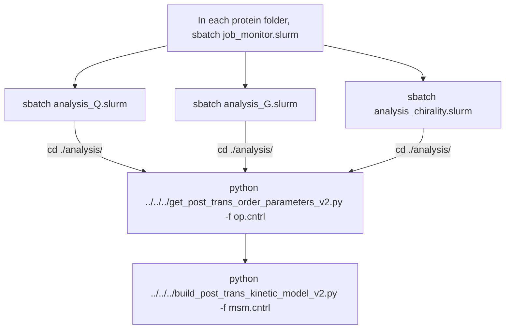

| Folder | Contents |
| ------ | -------- |
| `P16152/1-50/` | Subfolders containing input files for running post-translational folding simulations for the young-ubiquitinated and entangled protein P16152 |
| `A6NDU8/1-50/` | Subfolders containing input files for running post-translational folding simulations for the non-ubiquitinated and non-entangled protein A6NDU8 |

| File | Contents |
| ------ | -------- |
| `get_post_trans_order_parameters_v2.py` | Python script to parse order parameters Q, G and K from text files and save them as NumPy arrays |
| `build_post_trans_kinetic_model_v2.py` | Python script to cluster post-translational folding simulation structures into metastable states, extract representative structures and plot −ln(P) and state maps |

Within each protein subfolder, you will find:

- A `setup` folder containing:
  - AlphaFold structure (`.pdb` format)
  - Secondary structural elements definition file (`secondary_struc_defs.txt`)
  - Domain definition file (`domain_def.dat`)
  - Coarse-grained (CG) protein model files (`.psf`, `.cor`, `.prm`, `.xml`, `.top`)
  
  All these files were obtained from the previous step [`0_gen_parameters`](../0_gen_parameters/)

- Folders `1` to `50` (replicates) containing
  - Full length nascen chain protein `.psf` file
  - The protein coordinates and velocities obtained at the end of co-translational simulation (`.ncrst`)
  
  All these files were obtained from the previous step [`2_continuous_synthesis`](../2_continuous_synthesis/)

- `extend_sim_roar.py`  
  Python script to run a single post-translational simulation trajectory. The underlying code and usage instructions are available [here](https://github.com/obrien-lab/cg_simtk_protein_folding/wiki/post_trans_single_run_v2.py). This will generate `dcd`, `ncrst` and `out` files in each replicate's folder. The trajectories and outputs are available on [CyVerse](https://data.cyverse.org/dav-anon/iplant/projects/NCEMS/working-groups/protein-misfolding-aging/data/Protein-entanglement-misfolding-determines-divergent-fates/post_translation/).

- `job_monitor_roar.py`  
  Python script to monitor and manage jobs running in the SLURM system.

- `job_monitor.slurm`  
  SLURM script for submitting the `job_monitor_roar.py` script to the GPU cluster.

- `analysis_Q.slurm`  
  SLURM script for submitting the analysis job for the order parameter **Q** to a CPU cluster. The code and usage instructions are available [here](https://github.com/obrien-lab/cg_simtk_protein_folding/wiki/calc_native_contact_fraction.pl). This will create a folder `./analysis/qbb`.

- `analysis_G.slurm`  
  SLURM script for submitting the analysis job for the order parameter **G** to a CPU cluster. The code and usage instructions are available [here](https://github.com/obrien-lab/cg_simtk_protein_folding/wiki/calc_entanglement_number_v2.pl). This will create a folder `./analysis/G`.

- `analysis_chirality.slurm`  
  SLURM script for submitting the analysis job for the order parameter **K** to a CPU cluster. The code and usage instructions are available [here](https://github.com/obrien-lab/cg_simtk_protein_folding/wiki/calc_chirality_number.pl). This will create a folder `./analysis/chirality`.

- An `analysis` folder containing:
  - `op.cntrl`  
    Configuration file for `./get_post_trans_order_parameters_v2.py`. Run the command `python ../../../get_post_trans_order_parameters_v2.py -f op.cntrl`, which will generate `*_K.npy`, `*_QBB.npy` and `*_Entanglement.npy`.
  - `get_rm_traj_id.py`  
    Python script to identify trajectories containing mirror-image structures, which are removed in downstream analyses
  - `msm.cntrl`  
    Configuration file for `./build_post_trans_kinetic_model_v2.py`. Run the command `python ../../../build_post_trans_kinetic_model_v2.py -f msm.cntrl`. This generates `MSM.svg`, which was used to make Fig. 3A and B, `msm_data.npz`, `*_state_map_data.npz`, `Raw_data_Free_energy_*.csv`, `Raw_data_State_map_*.csv`, `sampled_traj.dcd` and a folder `state_struct/`
  - `state_struct/`
    Folder generated after running `./build_post_trans_kinetic_model_v2.py`, containing representative structures (`.pdb`), VMD visualization scripts (`.tcl`) and rendered images (`.tga`). The images were used to make Fig. 3C and D.

## Workflow

